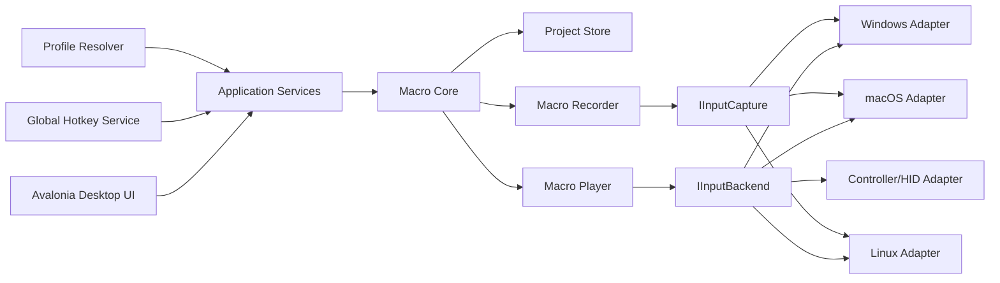
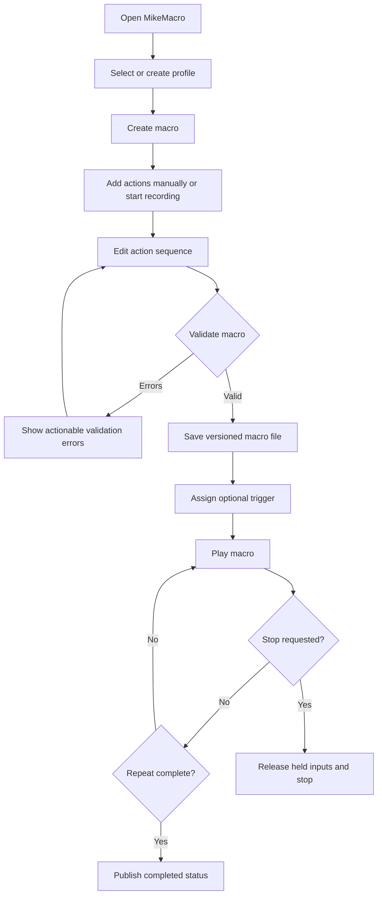
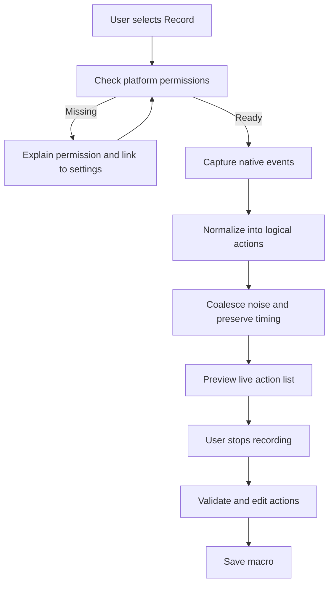
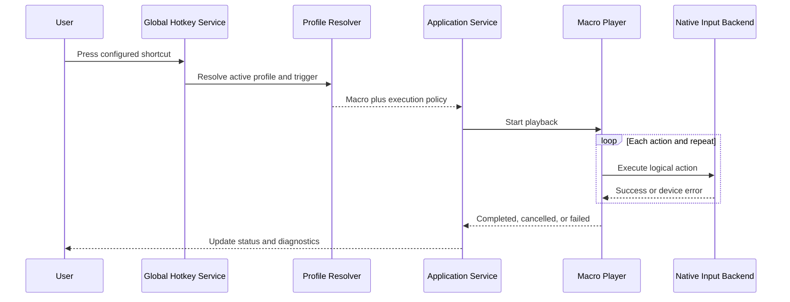
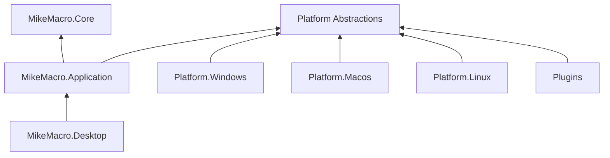

# MikeMacro Execution Plan

## 1. Product Goal

MikeMacro will be a cross-platform desktop automation tool that lets a user:

- Create, edit, import, and organize macros.
- Record keyboard and mouse input.
- Play actions once, repeatedly, or until stopped.
- Assign global hotkeys and application profiles.
- Use keyboard, mouse, controller, and future device integrations through the
  same macro model.
- See exactly what will execute before it runs.
- Stop execution immediately and recover safely from partial input sequences.
- Save portable, versioned macro files.

The product must be useful for accessibility and productivity automation as well
as gaming. It must not depend on a single hardware vendor or operating system.

## 2. Architecture Decision

### Recommended stack

| Concern | Choice | Reason |
| --- | --- | --- |
| Core language | C# | Strong typing, mature desktop tooling, and native OS interop |
| Runtime | .NET 8 LTS | Stable long-term support and cross-platform runtime |
| Desktop UI | Avalonia UI | One desktop UI for Windows, macOS, and Linux |
| Core storage | `System.Text.Json` | Built-in, fast, versionable JSON format |
| Unit tests | xUnit | Good .NET tooling and readable tests |
| Native input | OS-specific adapters | Correct permissions and event semantics per OS |
| Packaging | MSIX/installer, DMG, AppImage or Flatpak | Native distribution expectations per platform |

### Architectural rules

1. The core must never call Windows, macOS, or Linux APIs directly.
2. UI code must never synthesize input directly; it calls application services.
3. Every platform integration implements an explicit port such as
   `IInputBackend`, `IInputCapture`, or `IGlobalHotkeyService`.
4. Macro files contain logical actions, not native scan codes or OS handles.
5. Playback must be cancellable, observable, and testable with a fake backend.
6. Permissions, unsupported features, and device failures must be visible to
   the user rather than silently ignored.
7. Features are added behind versioned contracts and migration tests.

## 3. System Flow



## 4. Main User Flows

### Create and run a macro



### Record input



### Triggered playback



## 5. Delivery Phases

### Phase 0: Foundation and contracts

Status: **In progress**

- Keep the current .NET solution and core project.
- Finalize `Macro`, `MacroAction`, validation, and JSON schema.
- Add schema version and migrations before public files are released.
- Define result types for playback completion, cancellation, and failure.
- Add structured logging and a consistent error model.
- Add CI for build, tests, formatting, and analyzers.

Exit criteria:

- Core builds on Windows, macOS, and Linux CI runners.
- Macro files round-trip across supported versions.
- Playback behavior is fully testable without physical devices.

### Phase 1: Desktop shell and manual editor

- Create the Avalonia desktop project.
- Add profile and macro navigation.
- Add action list editor with add, delete, duplicate, move, and edit operations.
- Add save, load, import, and export commands.
- Add validation messages before execution.
- Add a dry-run preview that never sends real input.

Exit criteria:

- A user can create and edit a macro without recording.
- The editor can open files produced by the core test fixtures.
- Invalid actions cannot be started.

### Phase 2: Playback engine and safety controls

- Add real playback progress and current-action status.
- Add pause, resume, stop, and emergency stop.
- Track held keys and mouse buttons and release them on cancellation.
- Add configurable timing precision and repeat policies.
- Add a playback event stream for the UI.

Exit criteria:

- Stop always completes within the documented response target.
- Held inputs are released after normal stop, cancellation, and failure.
- The UI remains responsive during long-running playback.

### Phase 3: Windows adapter

- Implement keyboard and mouse injection with Windows `SendInput`.
- Implement low-level capture and global hotkeys with the required permissions.
- Detect foreground application and window identity.
- Add Windows-specific integration tests where CI permits.

Exit criteria:

- Windows users can record, edit, trigger, and play keyboard/mouse macros.
- Unsupported permissions are diagnosed clearly.
- The core remains free of Windows-specific references.

### Phase 4: Linux and macOS adapters

- Linux: choose the least-privileged supported path, documenting `uinput`,
  desktop-session, Wayland, and X11 limitations.
- macOS: use Quartz event APIs and document Accessibility/Input Monitoring
  permissions.
- Add a capabilities screen showing what each environment supports.
- Keep unsupported features disabled rather than pretending they work.

Exit criteria:

- Each platform can play the common action subset.
- Platform limitations are visible in the UI and documentation.
- Adapter failures do not corrupt macro files or crash the app.

### Phase 5: Recording, profiles, and triggers

- Add recording controls and timing normalization.
- Add global hotkey registration.
- Add application-aware profiles.
- Add trigger conflict detection and priority rules.
- Add optional mouse color/screen triggers only after the basic trigger model is
  stable and permission behavior is documented.

Exit criteria:

- A user can record and bind a macro without manual file editing.
- Conflicting triggers are detected before activation.
- Recording produces deterministic, editable actions.

### Phase 6: Device plugins and advanced actions

- Define a versioned plugin contract and capability discovery.
- Add controller/gamepad mapping through a separate adapter.
- Add MIDI, serial, or vendor SDK adapters only as isolated plugins.
- Add conditional actions, variables, loops, and profile context carefully.
- Add an action sandbox and explicit trust model for any scripting feature.

Exit criteria:

- A plugin cannot crash the core process without a clear failure boundary.
- Device-specific actions degrade gracefully on another machine.
- Macro portability is preserved for common actions.

### Phase 7: Release engineering

- Add signed builds and reproducible versioned artifacts.
- Add platform installers and upgrade migration tests.
- Add crash reporting with opt-in privacy controls.
- Publish user documentation and a compatibility matrix.
- Establish a release checklist and rollback process.

Exit criteria:

- Fresh installation and upgrade are tested on all supported platforms.
- Users can export diagnostics without exposing macro contents by default.
- A release can be built from a clean checkout.

## 6. Target Folder Structure

```text
MikeMacro/
├── README.md
├── LICENSE
├── MikeMacro.slnx
├── Directory.Build.props
├── Directory.Packages.props
├── global.json
├── .editorconfig
├── .github/
│   └── workflows/
│       ├── build.yml
│       ├── test.yml
│       └── release.yml
├── docs/
│   ├── EXECUTION_PLAN.md
│   ├── ARCHITECTURE.md
│   ├── MACRO_FORMAT.md
│   ├── PLATFORM_SUPPORT.md
│   └── SECURITY.md
├── src/
│   ├── MikeMacro.Core/
│   │   ├── Models/
│   │   ├── Playback/
│   │   ├── Recording/
│   │   ├── Storage/
│   │   ├── Triggers/
│   │   └── MikeMacro.Core.csproj
│   ├── MikeMacro.Application/
│   │   ├── Profiles/
│   │   ├── Services/
│   │   ├── Commands/
│   │   └── MikeMacro.Application.csproj
│   ├── MikeMacro.Desktop/
│   │   ├── Views/
│   │   ├── ViewModels/
│   │   ├── Assets/
│   │   └── MikeMacro.Desktop.csproj
│   ├── MikeMacro.Platform.Abstractions/
│   │   ├── Input/
│   │   ├── Capture/
│   │   ├── Hotkeys/
│   │   └── MikeMacro.Platform.Abstractions.csproj
│   ├── MikeMacro.Platform.Windows/
│   ├── MikeMacro.Platform.Macos/
│   ├── MikeMacro.Platform.Linux/
│   └── MikeMacro.Plugins/
├── tests/
│   ├── MikeMacro.Core.Tests/
│   ├── MikeMacro.Application.Tests/
│   ├── MikeMacro.Desktop.Tests/
│   ├── MikeMacro.Platform.Tests/
│   └── MikeMacro.IntegrationTests/
└── tools/
    ├── MacroValidator/
    └── TestInputBackend/
```

### Dependency direction



The arrows point toward dependencies. `MikeMacro.Core` must remain at the
bottom and must not reference UI or operating-system projects.

## 7. Testing Strategy

| Layer | Test focus |
| --- | --- |
| Core unit tests | Validation, action semantics, timing, cancellation, migrations |
| Application tests | Commands, profile resolution, trigger conflicts, error handling |
| UI tests | Navigation, editor behavior, disabled states, accessibility labels |
| Adapter tests | Native event translation and capability detection |
| Integration tests | Real backend smoke tests on supported CI machines |
| Manual matrix | Permissions, Wayland/X11, macOS security prompts, multi-monitor input |

Every bug involving playback, recording, persistence, or triggers must add a
regression test at the lowest layer that can reproduce it.

## 8. Safety and Security Requirements

- Provide a visible emergency stop control and configurable global stop hotkey.
- Release every key/button held by a macro when playback ends unexpectedly.
- Never execute imported scripts automatically.
- Treat plugins and scripts as untrusted until explicitly enabled.
- Do not log typed text, credentials, or full input streams by default.
- Store macro files as user data and validate all imported values and sizes.
- Explain OS permissions and collect only the permissions needed by the feature.

## 9. Immediate Next Sprint

1. Add `SchemaVersion` to the macro document.
2. Add `PlaybackResult`, progress events, and held-input cleanup contracts.
3. Add a minimal Avalonia desktop shell with a macro list and action editor.
4. Add a fake backend playback preview in the UI.
5. Add CI build/test workflow.

The first usable release should come after Phases 1 through 3. Device plugins,
screen triggers, and scripting should follow the stable core rather than drive
the initial design.